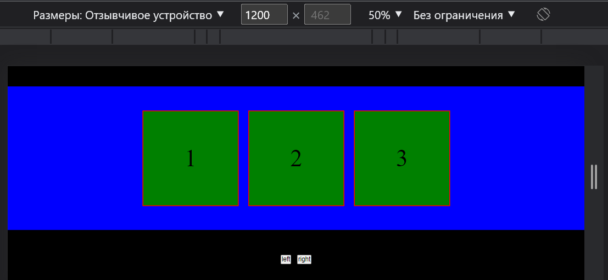

# VerySimpleSliderPlugin

### HTML
```html
    <div id="slider">
      <div>1</div>
      <div>2</div>
      <div>3</div>
    </div>

   <!-- OR -->

   <div class="slider">
      <div>1</div>
      <div>2</div>
      <div>3</div>
   </div>
```
---
### JavaScript
```JS
const slider = new verySimpleSlider('#slider');
```
>Also verySimpleSlider takes a settings object

```JS
const slider = new verySimpleSlider(
    '#slider',
    {
        // DEFAULT VALUES
        items: 1, // -> number of visible items
        itemsGap: 20, // -> spacing between items in pixels
        btnLeft: false, // -> '.btnLeft' or '#btnLeft'
        btnRight: false, // -> '.btnRight' or '#btnRight'
        animTime: 500, // -> ANIMATION TIME IN MILLISECOND
        autoScroll: false, // -> true
        autoScrollTime: 3000, // -> AUTI SCROLL TIME IN MILLISECOND
        stopAutoScrollWhenMouseOnElement: '#slider' // -> false
        activateSliderWhen: false // -> activate slider at screen resolution = "takes a number, indicate in pixels"
        responsive: { // -> if you need to change the number of "items" depending on the screen resolution
            1000: { // -> equal to or less than this value in pixels
                items: 1 // -> number of visible items
            },

            1200: {
                items: 2
            }

            1400: { 
                items: 4
            }
    }
);
```

>if "btnLeft" and "btnRight" are not assigned then "autoScroll: true". Can be forced to turn off "autoScroll: false"

## Example

```html
<!-- HTML -->

<div class="wrap">
    <ul id="slider">
        <li class="slider-item">1</li>
        <li class="slider-item">2</li>
        <li class="slider-item">3</li>
        <li class="slider-item">4</li>
    </ul>
</div>

<div class="btn">
    <button class="left">left</button>
    <button class="right">right</button>
</div>
```

```JavaScript
// JavaScript

    const slider = new verySimpleSlider(
    '#slider',
    {
        items: 3,
        btnLeft: '.btn .left',
        btnRight: '.btn .right',
        autoScroll: true,
        stopAutoScrollWhenMouseOnElement: '.wrap',
        activateSliderWhen: 1200

    }
);
```


